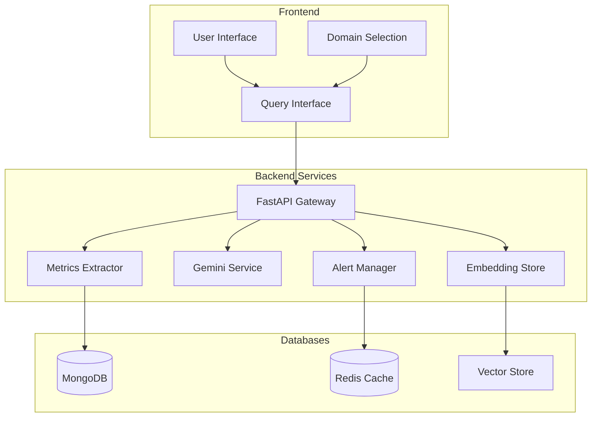
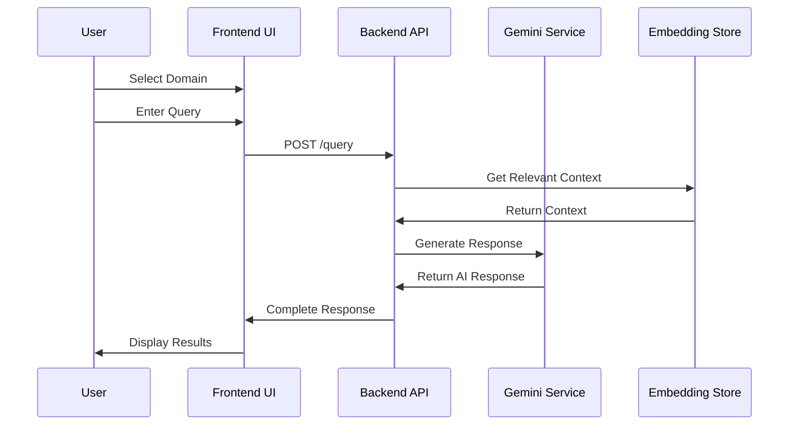
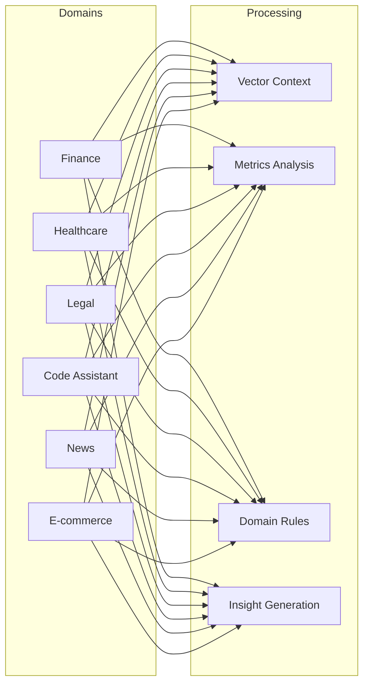
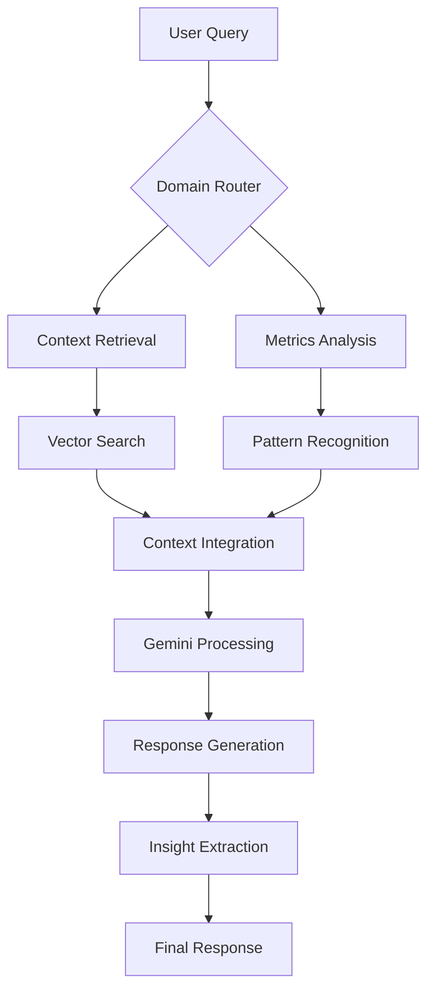
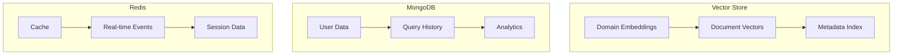
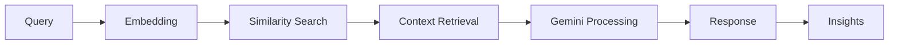
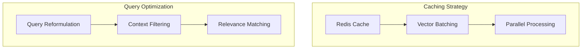
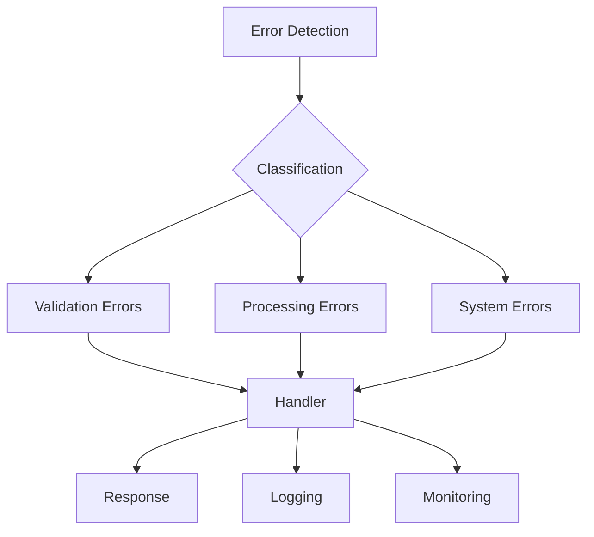

# M.A.D.H.A.V.A. Application Workflow

## System Architecture Overview

## Detailed Workflow

### 1. User Interaction Flow

### 2. Domain-Specific Processing

## Component Details

### 1. Frontend Components

- **User Interface**
  - Domain selection cards
  - Query interface
  - Response display
  - Insights section
  - Metrics visualization

### 2. Backend Services

- **FastAPI Gateway**
  - Route handling
  - Request validation
  - Response formatting
  - Error handling
  - CORS management

- **Embedding Store**
  - Vector similarity search
  - Context retrieval
  - Domain-specific embeddings
  - Metadata filtering

- **Gemini Service**
  - Query processing
  - Context integration
  - Response generation
  - Domain-specific insights

- **Metrics Extractor**
  - Data analysis
  - Pattern recognition
  - Statistical processing
  - Trend identification

- **Alert Manager**
  - Real-time notifications
  - WebSocket connections
  - Alert history
  - Severity management

### 3. Data Flow

### 4. Database Architecture

## Key Features

### 1. Domain-Specific Processing

- Finance: Market analysis, investment insights
- Healthcare: Medical research, clinical analysis
- Legal: Case analysis, compliance
- Code Assistant: AI debugging, code review
- News: Trend analysis, real-time updates
- E-commerce: Market trends, consumer behavior

### 2. RAG Implementation

### 3. Performance Optimization

## Error Handling and Monitoring

This flowchart provides a comprehensive overview of the M.A.D.H.A.V.A. application's architecture, components, and data flow. Each section details the specific responsibilities and interactions within the system, making it easier to understand the complete workflow of the RAG implementation.
